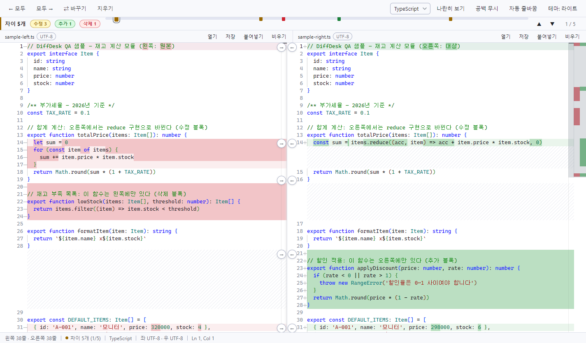
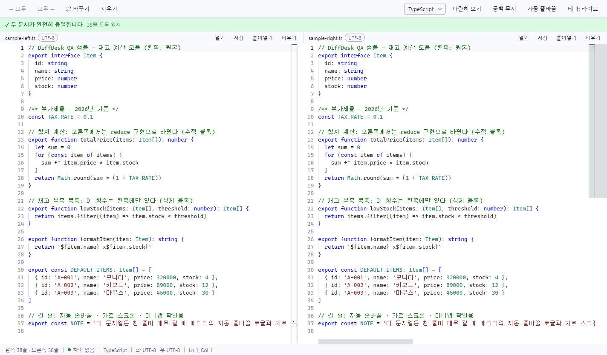
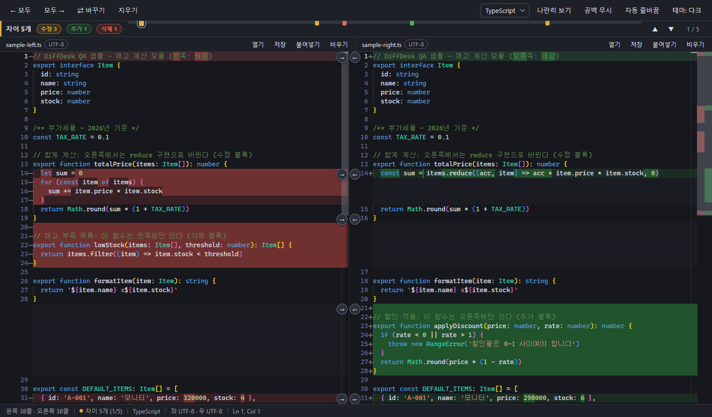
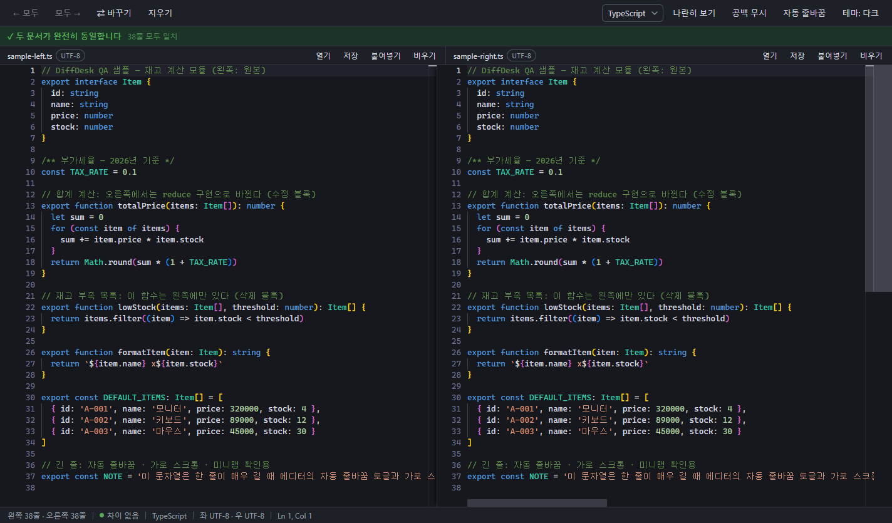

# DiffDesk

웹 디프 도구에 회사 코드를 붙여넣지 않기 위해 만든 완전 오프라인 텍스트·코드 비교/병합 데스크톱 앱 — DiffChecker류 대체, 설치 불필요, 외부 요청 0건.




## ✨ 특징

- **나란히 / 한 줄 비교** — Monaco(VS Code 디프 엔진) 기반. 입력하는 즉시 라이브 재계산(비교 버튼 없음), 단어 단위 하이라이트, 양쪽 판 모두 직접 편집 가능.
- **비교 결과 밴드 (v1.1)** — 툴바 아래 상시 밴드. 다르면 "차이 k개" + 수정·추가·삭제 분해 칩 + 위치 리본(마커 클릭 = 해당 차이로 점프) + ▲▼ 내비게이션. 같으면 줄 전체가 초록으로 "✓ 두 문서가 완전히 동일합니다 · n줄 모두 일치". 빈 문서면 "비교할 내용이 없습니다".
- **2-way 병합** — 차이 블록마다 [→][←] 버튼으로 좌↔우 복사, 모두 →/← 일괄 적용, 전부 `Ctrl+Z` 취소 가능.
- **인코딩 자동 감지** — UTF-8 / EUC-KR(CP949) / UTF-16 LE·BE, BOM 처리. 저장 시 원본 인코딩·BOM 유지 — 한글 코드 파일 1급 지원.
- **파일 다루기** — 열기 다이얼로그, 반쪽 드래그&드롭(왼쪽 반 = 왼쪽 판), 붙여넣기(전체 교체), 저장.
- **구문 강조 25+ 언어** — 확장자 자동 감지 + 수동 선택.
- **보기 옵션** — 다크/라이트/시스템 테마, 공백 무시, 자동 줄바꿈, `Ctrl+휠` 글꼴 확대/축소.
- **자체 테마** — 먹색·밤하늘·흑연·자주빛·청안개·백지. 외부 테마의 이름이나 팔레트를 사용하지 않습니다. 이전 테마 설정은 새 자체 테마로 자동 연결됩니다.

## 📷 스크린샷

|  | 차이 상태 | 동일 상태 |
| --- | --- | --- |
| **라이트** |  |  |
| **다크** |  |  |

## ⬇ 다운로드·실행

[Releases](../../releases)에서 실행 방식을 선택할 수 있습니다. 또는 아래 "빌드·개발" 절을 따라 직접 빌드할 수 있습니다.

- **빠른 시작 ZIP (추천)**: `DiffDesk-fast-start.zip` — 원하는 폴더에 한 번 압축을 풀고 안의 `DiffDesk.exe`를 실행합니다. 이후 실행마다 압축을 풀 필요가 없습니다. EXE와 함께 있는 파일·폴더를 그대로 유지하세요.
- **단일 EXE**: `DiffDesk-portable.exe` — 빈 폴더에 옮겨도 단독 실행됩니다. 빠르게 해제되는 압축 방식을 사용하지만 실행할 때마다 임시 폴더에 풀기 때문에 ZIP의 폴더 버전보다 시작이 느릴 수 있습니다.
- **직접 빌드한 폴더 버전**: `release\win-unpacked\DiffDesk.exe` — ZIP과 같은 실행 방식입니다.
- **CLI**: `DiffDesk.exe 왼쪽파일 오른쪽파일`

> 서명 없는 빌드라 Windows SmartScreen 경고가 뜰 수 있습니다 — **"추가 정보" → "실행"** 으로 진행하세요.

요구사항: Windows 10/11 x64

## 🚀 사용법

1. **불러오기** — 파일을 판에 끌어다 놓거나(왼쪽 반 = 왼쪽 판), 붙여넣거나, `Ctrl+O` / `Ctrl+Shift+O`로 엽니다.
   빈 화면 안내는 툴바 아래 비교 결과 밴드에 표시됩니다.
2. **차이 읽기** — 비교 결과 밴드에서 차이 개수와 수정·추가·삭제 구성을 확인하고, 위치 리본 마커 클릭 또는 `F7` / `Shift+F7`로 이동합니다.
3. **병합·저장** — 차이 블록의 [→][←] 버튼(또는 모두 →/← 일괄)으로 병합하고 `Ctrl+S`로 저장합니다. 원본 인코딩·BOM이 그대로 유지됩니다.

## ⌨ 단축키

| 키 | 동작 |
| --- | --- |
| `Ctrl+O` / `Ctrl+Shift+O` | 왼쪽 / 오른쪽 파일 열기 |
| `Ctrl+S` | 포커스된 판 저장 |
| `F7` / `Shift+F7` | 다음 / 이전 차이로 이동 |
| `Ctrl+Alt+→` / `Ctrl+Alt+←` | 모두 오른쪽으로 / 왼쪽으로 복사 |
| `Ctrl+Alt+X` | 좌우 바꾸기 |
| `Ctrl+\` | 나란히 ↔ 한 줄 보기 전환 |
| `Alt+Z` | 자동 줄바꿈 전환 |

## 🛠 빌드·개발

```
npm install          # 최초 1회
npm run dev          # 개발 모드 (vite + electron)
npm run typecheck    # 타입 검사
npm run pack         # 아이콘 → 렌더러 → 메인 빌드 → release\ 에 EXE·ZIP 패키징
```

DiffDesk 변경 작업을 마칠 때는 항상 최신 코드로 ZIP을 만듭니다. `npm run pack`은 `release\DiffDesk-fast-start.zip`도 생성합니다. 프로젝트 작업 규칙은 [AGENTS.md](AGENTS.md)에 있습니다.

## 📁 구조·설정 파일

| 경로 | 내용 |
| --- | --- |
| `electron/` | 메인 프로세스 |
| `src/` | React 렌더러 |
| `src/styles` · `src/themes` | 디자인 시스템 |
| `shared/ipc.ts` | IPC 계약 |
| `docs/UI-SPEC.md` | 상세 UI 스펙 |

설정 파일은 `%APPDATA%\DiffDesk\settings.json`에 저장되며, 파손 시 자동으로 기본값으로 복구됩니다.

## ℹ 참고

- 20MB 초과 파일은 앞부분만 로드하고 판 헤더에 "잘림" 배지를 표시합니다.
- QA 플래그: `DiffDesk.exe --qa-screenshot=C:\경로\shot.png`는 내장 샘플 디프를 렌더해 스크린샷을 저장한 뒤 종료하고, `--qa-same`은 두 문서가 동일한 샘플 상태로 렌더합니다.
- 시작·동작 QA: renderer/Electron 빌드 후 `node scripts/qa-startup.cjs current --check --smoke`로 격리 프로필에서 빈 화면, 드롭, 문법 강조, 병합·실행 취소, 검색을 확인합니다. 결과 PNG/JSON은 `build/`에 저장됩니다.
- 패키지 시작 비교: 앱을 모두 닫고 `node scripts/qa-packaged-startup.cjs 실행파일경로 라벨`을 실행합니다. 각 실행의 캡처 파일 생성 시각에서 내장 캡처 대기 2.5초를 빼 시작 시간을 추정합니다. 프로세스 종료 시간은 압축 해제 폴더 정리도 포함하므로 별도로 기록합니다. 첫 실행의 캐시·보안 검사 때문에 편차가 있을 수 있습니다.
