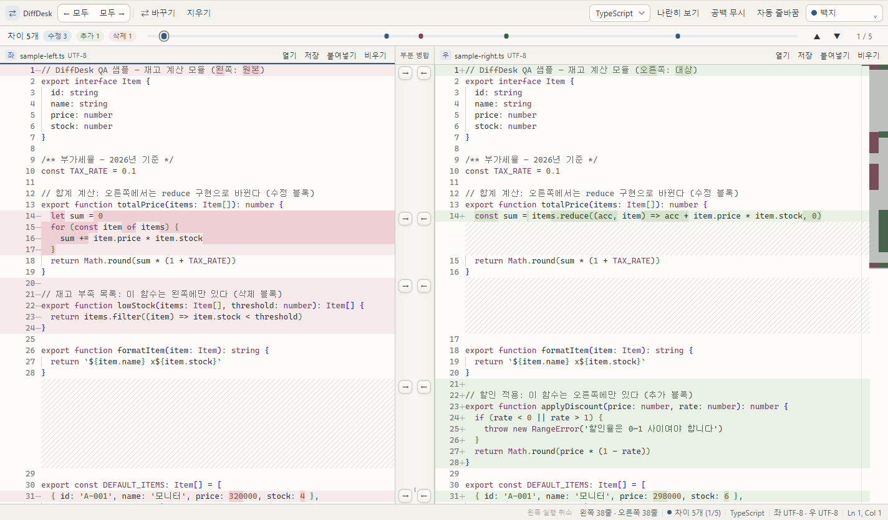
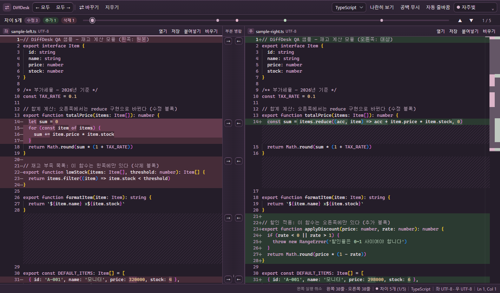

# 자체 테마와 ZIP 배포 규칙 — 2026-10-07

외부 테마 이름과 기존 팔레트를 제거하고 DiffDesk용 이름·색상을 새로 작성했다. 기본 라이트·다크·시스템 선택도 자체 팔레트를 사용한다. Monaco 테마 정의는 `inherit: false`로 등록하며, 외부 테마 정의나 테마 파일을 가져오지 않는다. 앱 실행에 필요한 Electron·Monaco 등 의존성의 라이선스와 저작권 고지는 보존한다.

| 이름 | 설정 ID | 배경 | 색감 |
|---|---|---|---|
| 먹색 | ink | #111315 | 검은 바탕과 부드러운 잉크색 |
| 밤하늘 | midnight | #15202b | 푸른 밤하늘색 |
| 흑연 | graphite | #25282d | 회색 바탕과 따뜻한 포인트 |
| 자주빛 | plum | #241d29 | 자주색 바탕과 은은한 대비 |
| 청안개 | mist | #273539 | 청록 회색 |
| 백지 | paper | #fdfcf9 | 따뜻한 밝은 바탕 |

이전 테마 ID는 저장 설정을 새 테마로 옮기는 읽기 호환 처리에서만 남겼다. 새 선택 목록이나 팔레트로는 제공하지 않는다. 밝기 설정이 맞지 않는 값, 시스템 모드의 프리셋, 잘못된 값과 프로토타입 속성명은 기본 테마로 안전하게 처리한다. 다음 저장 시 새 ID를 기록하며 글꼴 크기·줄바꿈 같은 설정을 보존한다.

`AGENTS.md`에 사용자 요청을 기록했다. 앞으로 DiffDesk 작업을 마칠 때는 최신 Windows x64 ZIP을 항상 만들고 경로와 검증 결과를 전달한다. 기존 커밋 승인 규칙도 유지한다. 기본 `npm run pack`에는 ZIP 타깃이 포함되어 있다.

## 검증

- 자동 테스트 16개 통과. 이전 저장 설정의 변환·재저장과 설정 보존, 네이티브 밝기 값, Monaco 테마, 색상 대비를 포함한다.
- renderer/Electron TypeScript 검사, 프로덕션 빌드, Windows x64 ZIP·EXE 패키징 통과.
- 여섯 테마 모두 실제 Electron 시작 배경과 앱 배경·선택된 테마 ID가 일치했다.
- 100/125/150% 배율과 최소 창·모션 감소에서 병합 버튼의 라인 번호 겹침과 툴바 넘침이 모두 0이었다.
- 먹색·백지의 최소 창에서 드롭, TypeScript 자동 감지·문법 강조, 부분 병합, 대상 실행 취소, 한 줄 보기, 전체 지우기, 빈 안내 복귀, Ctrl+F 검색을 확인했다.
- 독립 검토에서 기본 CSS 토큰 62개와 실행 중 적용값이 일치하고 Monaco 정의 8개의 배경과 상속 비활성화가 일치함을 확인했다. 중요한 결함은 발견되지 않았다.
- 최종 ASAR의 renderer/Electron 파일 101개를 로컬 빌드와 대조해 불일치 0개, QA 도구 포함 0개를 확인했다.
- ZIP 무결성 검사와 실제 압축 해제 후 EXE 실행·캡처·종료 3회가 통과했다. 캡처 대기 2.5초를 제외한 로드 시간 추정 중간값은 0.786초였다.

변경은 커밋하지 않았다. 이전 시안·결과 문서는 보관 기록으로 표시했고 이전 배포 파일은 교체하지 않았다.

## 결과 파일

- [최신 ZIP](../../release/custom-themes/DiffDesk-fast-start.zip): 114,681,605바이트
- [단일 EXE](../../release/custom-themes/DiffDesk-portable.exe): 118,928,931바이트
- [실제 화면·검증 JSON](2026-10-07-custom-themes-assets)

ZIP SHA-256: `5906fee145e896917c67144b180c0ab3b9f22e77f64e0a683461aa5e9e117678`

EXE SHA-256: `6e25fc57f5a41ca8f2a2657b22eac52d579f6b6ce23c36cd13d728b62b42c82a`

