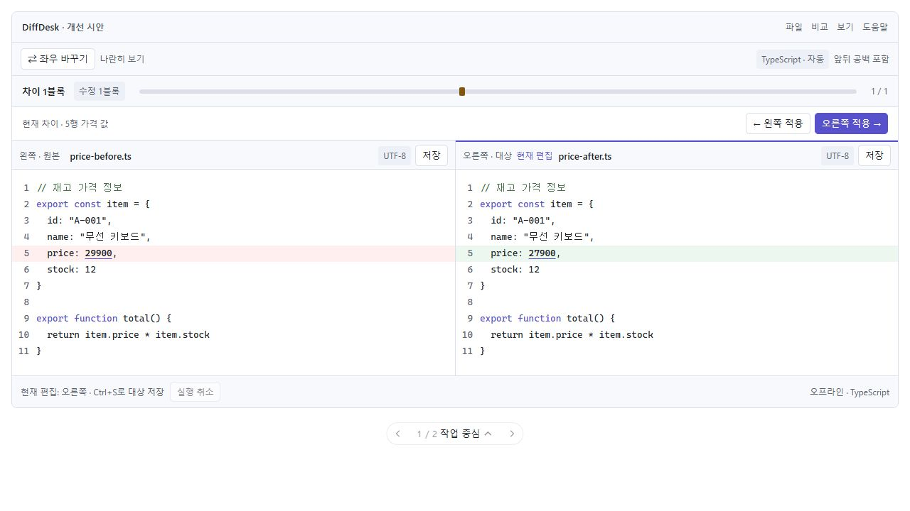
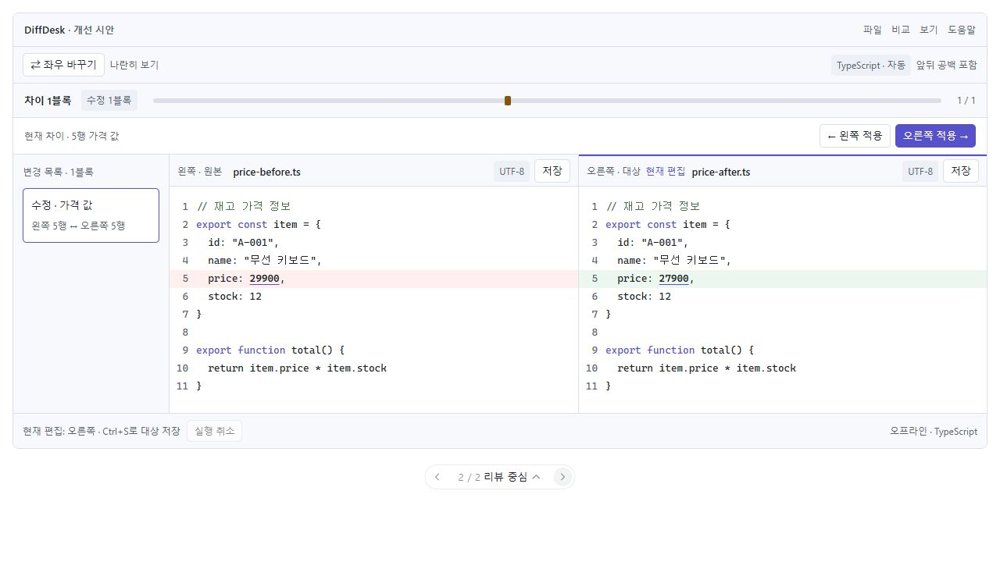
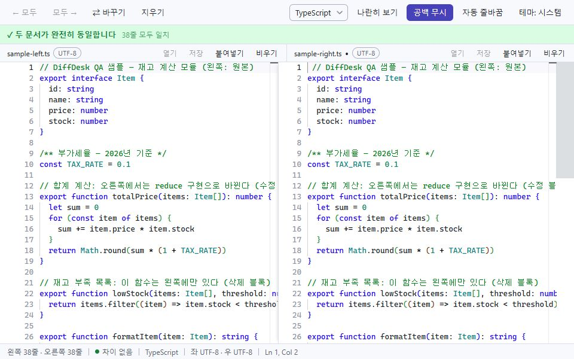
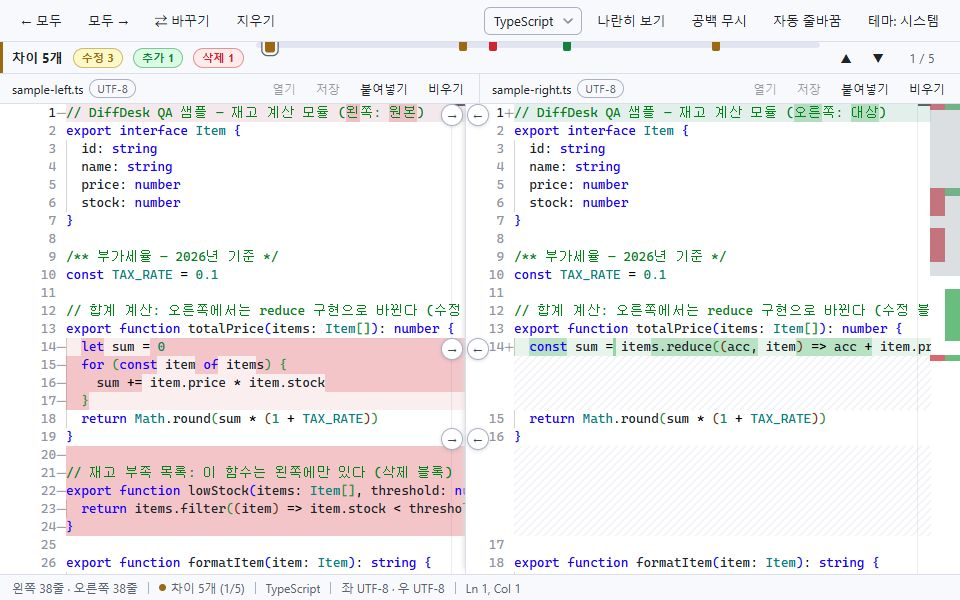
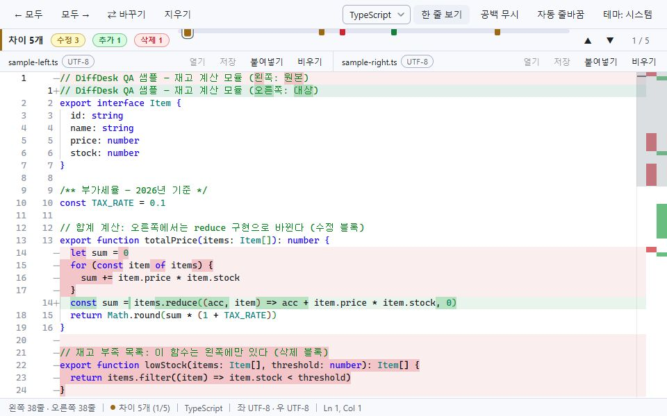
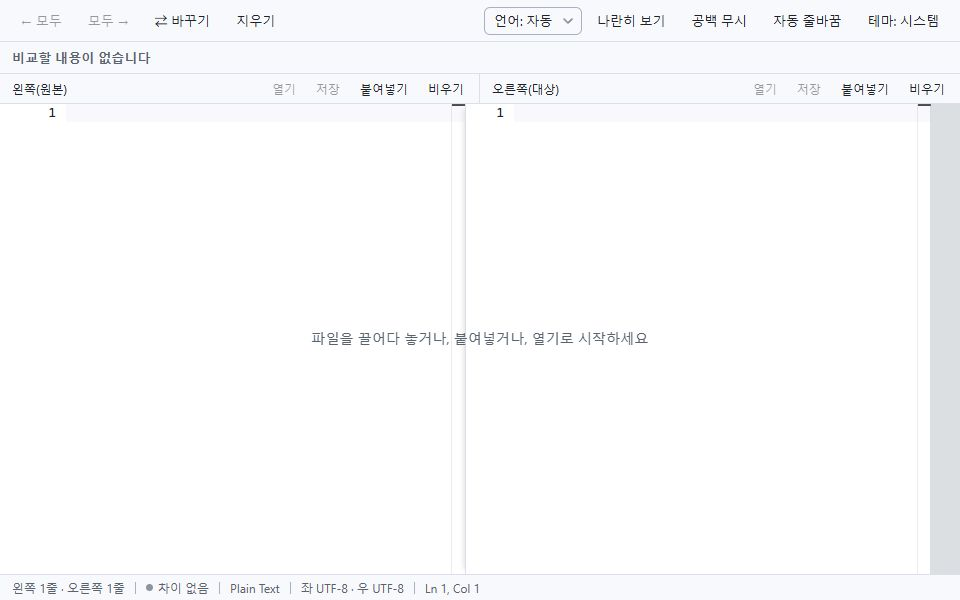

# DiffDesk 디자인·사용성 개선 분석 및 실행 계획

작성일: 2026-09-30 · 검토: 메인 에이전트 + 사용자 요청 디자이너 에이전트

## 1. 결론과 제품 방향

**기존의 두 판 비교 작업 공간을 유지하면서, 비교 결과의 신뢰도 → 병합·저장의 명확성 → 시각 정돈과 모션 순서로 개선하는 안을 권장한다.**

현재 화면은 코드 영역을 넓게 확보하고, 결과 밴드로 차이 개수와 변경 종류를 빠르게 보여준다. 전체 개편보다 실제 업무의 판단과 조작을 개선하는 편이 효과적이다. 특히 ‘완전히 동일’ 표현과 일부만 읽은 파일의 저장 정책은 꾸미기보다 먼저 다뤄야 한다.

검토 목표는 다음 세 가지다.

- 처음 실행한 사용자가 왼쪽·오른쪽에 내용을 넣고 첫 차이로 이동할 수 있다.
- 사용자가 비교 조건, 적용 방향, 저장 대상, 미저장 상태를 화면에서 식별할 수 있다.
- 긴 비교 작업에서도 코드 가독성과 키보드 흐름을 유지한다.

오프라인 동작, 한국어 UI, Monaco 기반 편집, 기존 단축키, 원본 인코딩 유지라는 제품 방향을 전제로 했다. 실제 사용자 인터뷰와 이용 통계는 제공되지 않았으므로, 개선 효과와 일정은 검증할 가설 및 추정이다.

## 2. 조사 범위와 증거 수준

검토 자료: README, UI-SPEC, DESIGN, React 컴포넌트, CSS 토큰, Monaco 테마, Electron 파일 열기·저장·종료 코드, 기존 라이트·다크 스크린샷.

현재 소스를 Vite로 실행해 브라우저 렌더러에서 1280×720와 960×600, 초기 상태, 차이 상태, 동일 샘플, 공백 차이, 나란히/한 줄 보기를 확인했다. 실제 비교 엔진과 렌더러는 동작하지만 브라우저 폴백의 네이티브 열기·저장은 비활성화된다. 이를 앱 결함으로 분류하지 않았다.

- **실행 확인:** 공백 무시 후 잘못된 동일 문구, 초기 계산 중 동일 문구, 리본 마커 잘림, 한 줄 모드에서 블록 병합 버튼 소실.
- **코드 확인:** 잘림 원본 덮어쓰기 경로, 미저장 문서 교체·종료 보호 부재, 활성 판 표시 부재, 고정 부드러운 스크롤, 저장/병합 피드백 부재.
- **추가 검증 필요:** Electron의 실제 파일 다이얼로그·종료, Windows 배율 125/150%, 많은 차이에서의 마커 중첩과 성능, 다크 테마 픽셀 대비, 사용자 작업 시간.

파일 손실 위험은 읽기 전용으로 코드 경로를 확인했다. 실제 원본을 덮어쓰는 실험은 수행하지 않았다. 분석 보고서와 증거 파일만 추가하며 제품 코드는 변경하지 않는다. 커밋은 사용자 승인 전 진행하지 않는다.

## 3. 유지할 강점

- 코드가 화면의 대부분을 차지하는 밀도와 익숙한 Monaco 편집 경험.
- 입력 즉시 비교, 단어 단위 강조, 양방향 편집, F7/Shift+F7 탐색.
- 고정 높이 결과 밴드와 수정·추가·삭제의 의미 색상.
- 라이트/다크/시스템 테마, 인코딩 배지, EUC-KR 지원.
- CSS의 포커스 표시 및 기본적인 모션 축소 대응.

## 4. 개선 백로그

P0는 파일 손실 가능성, P1은 결과 판단 또는 핵심 작업에 영향, P2는 조작 효율·표현·접근성 개선을 뜻한다.

| ID | 우선순위 | 발견 사항·증거 | 제안과 기대 효과 |
| --- | --- | --- | --- |
| U01 | P0 | **일부만 읽은 파일을 원본에 저장할 수 있다.** 20MB 초과 파일은 잘라 읽지만 저장 요청은 원본 경로와 현재 편집기 내용만 전달한다. 코드 확인. | 잘림 문서는 원본 덮어쓰기 차단. ‘일부 내용만 비교 중’ 상시 표시와 ‘표시된 부분을 다른 이름으로 저장’ 제공. 저장 계층도 완전 로드 여부를 확인. |
| U02 | P1 | **비교 조건·계산 상태를 동일 판정에 반영하지 않는다.** 공백을 넣은 문서에서 공백 무시를 켜면 ‘완전히 동일’; 초기 QA 로드도 잠시 같은 문구를 표시한다. 실행 확인. | ‘텍스트 동일’, ‘앞뒤 공백을 제외하면 동일’, ‘비교 중’, ‘부분 비교’, ‘비교를 완료하지 못함’을 구분. 완전 로드 및 최신 계산 완료 전에는 동일 판정 금지. |
| U03 | P1 | **미저장 내용을 새 파일로 교체하거나 종료할 때 보호가 없다.** loadPayload의 setValue는 이전 undo 이력도 초기화한다. 코드 확인. | 열기·드롭·CLI 재열기·종료에 저장/버리기/취소. 비우기·붙여넣기에는 복구 가능한 실행 취소 제공. 비우기 후 복구 시 내용뿐 아니라 파일명·경로·인코딩도 복구. |
| U04 | P1 | **저장 대상과 판 역할이 약하다.** 파일 로드 후 역할 라벨이 사라지고 활성 판은 ref로만 추적한다. 작은 수정 점만 표시한다. 실행·코드 확인. | ‘왼쪽·원본 / 오른쪽·대상’ 유지, 활성 헤더의 얇은 인디고 선과 ‘현재 편집’, ‘저장 안 됨’ 표시. Ctrl+S 대상도 상태줄에 표시. |
| U05 | P1 | **병합의 대상과 결과를 이해하기 어렵다.** 22px 화살표의 ‘복사’는 추가 블록에서 삭제를 뜻하기도 한다. 적용 후 안내가 없고 400ms 동안 클릭을 무시할 수 있다. 코드·화면 확인. | 대상과 효과를 표시: ‘오른쪽 3줄을 왼쪽 내용으로 교체’. 현재 차이 적용 명령과 ‘오른쪽 적용됨 · 실행 취소’. 재계산 중 명시적인 비활성 상태, 완료 이벤트 기준 복귀. |
| U06 | P2 | **한 줄 보기에서 블록 병합 경로가 사라진다.** 두 파일 헤더는 유지되지만 중앙 화살표 스트립을 숨긴다. 실행 확인. | 보기와 무관한 ‘현재 차이를 왼쪽/오른쪽에 적용’ 제공. 한 줄 보기 헤더는 두 파일의 관계와 편집 대상 표시. 드롭 시 대상 선택을 명시. |
| U07 | P2 | **위치 리본과 마커가 밴드 위쪽에 붙어 잘린다.** 1280px에서 밴드 y=42/h=32, 트랙 y=42/h=6, 마커 y=37.5 또는 39. 실행 측정. | 상속된 align-self:stretch와 6px 높이의 조합 정리. 밴드 중앙에 트랙 배치하고 마커 및 포커스 링 여유 확보. |
| U08 | P2 | **다크 화면의 주석이 변경 배경에 묻힌다.** vs-dark 구문색을 그대로 상속한다. 기존 스크린샷 및 팔레트 계산 확인. | 주석색을 밝게 조정하고 행 배경 알파를 절제. 변경 단어 강조는 유지. 실제 합성 배경 위의 텍스트 대비를 재측정. |
| U09 | P2 | **처음 시작하기와 로드·저장·오류 안내가 약하다.** 빈 화면은 클릭 불가 한 줄 안내, 오류는 alert, 성공·진행 UI는 없다. 실행·코드 확인. | 양쪽 입력 영역에 열기/붙여넣기 액션과 단축키. 한쪽만 입력한 상태도 안내. 로드·저장 중 상태, 저장 완료, 파일명·원인·재시도가 있는 오류 메시지 제공. |
| U10 | P2 | **툴바의 모든 명령이 같은 강도로 보인다.** 전체 교체·지우기와 보기 옵션이 구분 없이 나열된다. 960px 기본 화면에서는 잘림을 발견하지 않았다. | 현재 차이 탐색·적용은 바로 접근, 전체 교체·비우기는 ‘전체 작업’ 그룹, 언어·테마는 보조 그룹. 긴 파일명과 확대 환경에서만 필요시 메뉴로 접기. |
| U11 | P2 | **차이가 많을 때 리본 조작·키보드 비용이 커질 수 있다.** 모든 차이가 별도 button이며 작은 히트 영역이 밀집할 수 있다. 코드상 가설. | 밀집 구간 집계 또는 확대 탐색. 리본은 한 번의 Tab 진입과 방향키 이동 설계. 마커·버튼 의미에 변경 종류, 양쪽 줄 범위 포함. NVDA에서 이름과 현재 상태 검증. |
| U12 | P2 | **모션 축소가 차이 이동에 적용되지 않는다.** CSS 전환은 끄지만 이동은 ScrollType.Smooth 고정이다. 코드 확인. | OS 모션 축소 시 즉시 이동. 병합·상태 전환은 짧고 목적이 있는 피드백만 제공. 텍스트·행 높이·캐럿 위치를 움직이는 효과 배제. |

### 구현 근거 위치

- U01: `electron/encoding.ts`의 readFilePayload, `shared/ipc.ts`의 SaveRequest, `src/App.tsx:178`, `electron/main.ts:190`.
- U02: `src/components/StatusBand.tsx:32`, `src/App.tsx:60`, `src/App.tsx:375`, `src/App.tsx:389`.
- U03: `src/App.tsx:151`, `src/App.tsx:220`, `src/App.tsx:572`, `electron/main.ts:136`.
- U04: `src/components/PaneHeader.tsx:17`, `src/App.tsx:70`, `src/App.tsx:418`.
- U05: `src/components/ChunkStrip.tsx:36`, `src/styles/components.css:440`, `src/lib/mergeChunks.ts`의 applyChunk, `src/App.tsx:255`.
- U06: `src/App.tsx:696`, `src/App.tsx:549`, `src/components/ChunkStrip.tsx:18`.
- U07: `src/layout.css:44`, `src/styles/components.css:174`, `src/styles/components.css:260`.
- U08: `src/themes/monacoThemes.ts:11`, `src/themes/monacoThemes.ts:29`.
- U09: `src/components/DiffHost.tsx:22`, `src/App.tsx:36`, `src/App.tsx:169`, `src/App.tsx:178`.
- U10/U11: `src/components/Toolbar.tsx:30`, `src/components/StatusBand.tsx:46`, `src/styles/components.css:39`, `src/styles/components.css:287`.
- U12: `src/App.tsx:282`, `src/styles/components.css:621`.

다크 주석의 대비는 #608B4E와 테마/변경 배경을 합성한 계산상 기본 바탕 약 4.47:1, 삭제 행 약 3.80:1, 삭제 텍스트 강조 중첩 약 2.43:1이다. 글자 가장자리나 실제 렌더 픽셀을 측정한 결과는 아니므로 최종 팔레트는 실측 검증 후 결정한다.

## 5. 디자인 대안과 권장안

| 안 | 화면 구성 | 장점 | 비용·제약 | 판단 |
| --- | --- | --- | --- | --- |
| 작업 중심 | 현재 2판 구조 + 정확한 결과 밴드 + 현재 차이 적용 + 지속적인 판 역할/상태 | 에디터 폭 유지, 적응 비용 낮음, 현재 구현 활용 | 차이가 아주 많을 때 목록 탐색은 제한적 | **첫 릴리스 권장** |
| 리뷰 중심 | 작업 중심 구성 + 접이식 변경 목록(200~240px) | 변경 종류·줄 범위·미리보기로 많은 차이 탐색 | 코드 폭 감소, 목록/현재 차이 동기화 필요 | 첫 릴리스 검증 뒤 선택적 추가 |
| 최소 수정 | 판정 문구·잘림 보호·리본 정렬·대비만 수정 | 출시가 빠름 | 병합 발견성·활성 판·빈 화면 문제는 남음 | 긴급 보완 릴리스에 적합 |

아래는 디자인 검토용 상호작용 시안이다. 적용·저장·실행 취소에 따른 화면 상태를 모형으로 확인하며 실제 파일을 읽거나 저장하지 않는다. 제품 구현은 이후 단계다.

### 작업 중심안의 구성

1. 상단 도구줄: 비교 보기와 조건, 좌우 바꾸기, 전체 작업, 보조 설정을 기능별로 구분한다.
2. 결과 밴드: 비교 결과와 적용 조건, 수정/추가/삭제 **블록** 수, 중앙 정렬 위치 트랙, 현재 순번과 이전/다음.
3. 현재 차이: 줄 범위와 적용 방향을 노출한다. 한 줄 보기에서도 유지한다.
4. 판 헤더: 역할 + 파일명 + 인코딩 + 미저장/부분 로드 상태 + 열기/저장. 활성 판을 명확히 표시한다.
5. 편집기: 변경 단어를 가장 강하게, 행 배경은 약하게. 전용 병합 거터가 코드·줄 번호·포커스 링을 덮지 않게 한다.
6. 하단 상태줄: 현재 편집 판·커서·인코딩·작업 피드백을 표시한다. 상단의 차이 개수 반복은 줄인다.

UI 글자는 13px을 기본으로 유지하며 부차 정보도 12px 정도를 권장한다. 파일 헤더는 기본 30px에서 36~40px, 현재 차이 적용 행은 32px 정도를 출발점으로 검토하되 실제 코드 영역 감소를 함께 확인한다. 컨트롤 유효 클릭 영역은 28~32px를 목표로 한다. 작은 원형 버튼에 히트 영역만 늘릴 때는 인접 에디터·다른 버튼과 중첩되지 않도록 한다.

좁은 창에서는 메뉴 접기로 보조 명령을 정리하고 현재 차이 적용 영역을 결과 밴드와 결합할 수 있다. 무조건 행을 늘리거나 폰트를 줄여 해결하지 않는다. 에디터 구분선을 움직였을 때 헤더·거터·드롭 대상도 같은 경계를 참조해야 한다.

### 비교 상태의 표현

| 상황 | 표시 예시 | 동작 |
| --- | --- | --- |
| 양쪽 입력 없음 | 비교할 내용을 넣어 주세요 | 양쪽 시작 액션 |
| 한쪽 입력 없음 | 오른쪽 내용을 넣거나 빈 문서와 비교하세요 | 한쪽 빈 파일도 유효한 비교로 허용 |
| 최신 계산 진행 | 비교 중… | 오래된 결과를 최신 결론처럼 표시하지 않음 |
| 완전 로드·계산 완료·텍스트 일치 | 두 문서의 텍스트가 동일합니다 | 인코딩/줄바꿈까지 파일 바이트가 같다는 의미로 쓰지 않음 |
| 공백 조건으로 차이 없음 | 앞뒤 공백을 제외하면 동일합니다 | 조건 칩 지속 표시 |
| 일부만 로드 | 일부 내용만 비교 중 · 전체 파일 일치 여부는 확인할 수 없습니다 | 원본 덮어쓰기 차단 |
| 계산 시간 제한/실패 | 비교를 완료하지 못했습니다 | 동일 선언 없이 재시도·보기 조정 안내 |

상태 계산은 ‘완전 로드 여부’와 ‘최신 편집 버전의 계산 완료’를 먼저 검사하고, 그 다음 차이 수와 비교 조건을 적용한다. 비교 엔진의 차이 0개만으로 전체 파일 동일성을 판단하지 않는다.

## 6. 애니메이션·상호작용 명세

아래 시간은 프로젝트 제안값이며 표준의 의무값이 아니다. 완료 판정은 애니메이션 타이머가 아니라 실제 작업 이벤트를 기준으로 한다.

| 대상 | 목적 | 권장 동작 | 모션 축소 |
| --- | --- | --- | --- |
| 버튼 hover/press | 누를 수 있음과 눌림 확인 | 색 전환 80~120ms, 이동 없이 처리 | 즉시 상태 변경 |
| 드롭 영역 | 어느 판에 열리는지 안내 | 120ms 불투명도 전환 + ‘왼쪽에 열기/오른쪽에 열기’ | 정적 강조 |
| 차이 이동 | 새 위치로 시선 유도 | Monaco가 허용하는 부드러운 이동 사용; 목표 체감 180~220ms, 도착 블록 160~200ms 강조 | ScrollType.Immediate, 정적 테두리 |
| 병합 완료 | 어느 판이 바뀌었는지 확인 | 대상 블록 배경 140~180ms 안정화 + 적용/실행 취소 메시지 | 즉시 반영 + 상태 메시지 |
| 로드·저장 | 기다림과 완료 구분 | 단기 작업은 즉시 결과, 길어질 때 상태 표시; 저장 완료는 비차단 텍스트 | 동일한 텍스트 피드백 |
| 보기·테마 전환 | 새 배치/색 확정 | 편집기는 즉시 재배치; 주변 UI만 필요시 100~150ms 전환 | 즉시 전환 |

Monaco 스크롤의 정확한 지속 시간은 현재 API의 제어 가능 여부를 먼저 확인한다. 별도 스크롤 루프를 얹어 커서·동기 스크롤을 방해하지 않는다. 큰 창 이동, 반짝임, 코드 행 높이 변화, 반복되는 완료 애니메이션은 기본안에 포함하지 않는다. 실행 취소 버튼은 알림이 사라진 뒤에도 메뉴/단축키로 접근 가능해야 한다.

## 7. 실행 계획

**1인 개발자가 기존 구조를 유지하며 구현·개발 검증에 9~12 작업일을 예상한다.** 구현 전 범위 확정과 중간 디자인 확인을 전제로 한 추정이다. 사용자 모집·평가와 새로운 변경 목록 작업은 별도다.

| 단계 | 기간 추정 | 작업·주요 파일 | 완료 기준 |
| --- | --- | --- | --- |
| 신뢰·파일 보호 | 3~4일 | U01~U03. App 상태·문서 전환, StatusBand, shared/ipc, Electron 저장/종료 | 공백 동일 오표시 제거, 최신 계산만 결론 표시, 잘린 원본 보존, 미저장 전환 취소 시 내용 보존 |
| 병합·저장 조작 | 2~3일 | U04~U06. PaneHeader, Toolbar, ChunkStrip, DiffHost, App | 활성 판·저장 대상 식별, 양쪽 적용 효과 설명, 한 줄 모드 블록 적용, 실행 취소/재계산 상태 표시 |
| 시각·피드백·모션 | 2~3일 | U07~U12. tokens/components/layout CSS, Monaco 테마, 안내 UI, 이동 처리 | 리본과 포커스 링 잘림 제거, 다크 변경 주석 대비 확인, 시작/오류/저장 안내, 모션 축소에서 즉시 이동 |
| 통합 검증 | 2일 | 실제 Electron·Windows, 작업 시나리오, 비교/파일 보호 회귀 확인 | 아래 개발 검증 표 통과, 전후 화면 확인 |

의존 순서: 비교 상태와 문서 보호를 먼저 확정 → 이를 소비하는 결과 밴드·병합·저장 UI → 디자인 토큰/모션 → 통합 검증. 디자인 토큰은 CSS, Monaco 테마, Electron 창 배경의 동기 계약을 유지한다.

App 전체 재작성이나 비교 엔진 교체는 필요하지 않다. 상태와 파일 보호가 복잡해지는 부분만 비교 상태/문서 작업 처리 단위로 분리하고, 관련 없는 구조 개편은 범위에 넣지 않는다.

리뷰 중심안의 접이식 목록은 첫 개선안 사용성 검증에서 많은 차이 탐색이 실제 병목으로 확인될 때 추가한다. 2~3일은 초기 구현 추정이며 접근성·대규모 차이 검증은 별도로 산정한다. 최근 파일/자동 복구 기록은 회사 코드의 저장 정책을 별도로 정해야 하므로 이번 기본안에 포함하지 않는다.

## 8. 검증과 성공 기준

| 검증 | 구체적인 통과 조건 |
| --- | --- |
| 정확한 동일 표현 | 동일 텍스트, 앞뒤 공백만 다른 텍스트, 계산 중, 부분 로드를 구분. 제한/실패 결과를 동일로 표시하지 않음. 인코딩 차이는 메타 정보로 확인하고 텍스트 비교와 파일 바이트 동일성을 혼동하지 않음. LF/CRLF 별도 표시는 이번 기본안에 포함하지 않음 |
| 잘림 보호 | 20MB 초과 테스트 파일 로드 후 일반 저장 시 원본 크기·해시 유지. 부분 내용 내보내기는 별도 경로 선택과 범위 설명을 제공 |
| 미저장 보호 | 열기/1·2개 드롭/CLI 재열기/종료에서 취소 시 양쪽 내용·메타 보존. 두 판이 미저장일 때 순서대로 처리해 첫 판만 사라지는 상황 방지 |
| 병합·복구 | 수정/추가/삭제, 문서 시작/끝, 양방향/전체 적용, 한 줄 보기에서 정확한 대상 반영. 직후 실행 취소로 같은 대상의 내용 복구. 비우기/스왑 복구의 메타 의미도 확인 |
| 키보드·접근성 | 마우스 없이 내용 넣기→F7 탐색→현재 차이 적용→실행 취소→대상 저장 수행. 좌/우 컨트롤 이름 구분, 상태 메시지 읽기, 100개 차이에서 과도한 Tab 반복 없음 |
| 창 크기·배율 | 960×600, 1100×700, 1440×900 및 Windows 100/125/150%에서 긴 파일명과 경로, 필수 버튼, 포커스 링이 겹치거나 잘리지 않음 |
| 테마·대비 | 라이트/다크에서 일반 텍스트 4.5:1 목표. 구문 주석과 변경 행·단어의 실제 합성 배경 측정. 변경 의미에 색뿐 아니라 텍스트/아이콘 사용 |
| 모션·연타 | OS 모션 축소에서 부드러운 스크롤/크기 변화 없음. 적용 중 연타에도 오래된 변경 적용 없음. 피드백 표시가 편집기 포커스를 빼앗지 않음 |
| 성능·오프라인 | 현재 비교 계산 시간을 먼저 측정한 뒤 개선 전후 비교. 많은 차이에서도 입력 반응 유지. 앱의 오프라인·외부 요청 0건 유지 |

사용자 평가 지표는 첫 실행→첫 차이 이동 시간, 병합 방향 오선택, 저장 대상 오선택, 병합 후 취소 성공률로 잡는다. 참여자 3~5명이 확보되면 1~2일을 별도로 잡아 같은 과제를 개선 전후 비교한다. 첫 차이 이동 시간 20% 감소와 병합/저장 대상 오선택 0건을 파일럿 목표로 삼는다. 이는 현재 성과 수치가 아니라 제안한 목표다.

## 9. 실행 화면 증거

### 공백 무시 상태에서 ‘완전히 동일’ 오표시

동일 QA 문서의 오른쪽 첫 줄에 공백 한 글자를 추가했다. 공백 무시를 끄면 차이 1개, 켜면 아래처럼 ‘완전히 동일’로 바뀐다.

### 960×600 비교 화면

기본 컨트롤 잘림은 확인하지 못했다. 리본은 밴드 중앙에서 벗어나며 마커 윗부분이 잘린다. 코드 긴 줄은 수평 스크롤/줄바꿈의 선택 대상이다.

### 한 줄 보기와 빈 화면

## 10. 접근성 참고 근거

WCAG는 Electron 렌더러의 UI 설계·검증 참고 기준으로 활용했으며, 전체 적합성을 인증한 것은 아니다.

- 유효 타깃 24×24 CSS px 또는 충분한 간격·동등 조작 등 예외를 함께 평가한다. ‘22px이므로 무조건 위반’이라고 판정하지 않는다. 프로젝트 권장 조작 영역은 28~32px다. [W3C Target Size (Minimum)](https://www.w3.org/WAI/WCAG22/Understanding/target-size-minimum.html)
- 작업 결과 메시지는 포커스를 이동시키지 않고 보조 기술이 알아차릴 수 있게 제공한다. [W3C Status Messages](https://www.w3.org/WAI/WCAG22/Understanding/status-messages.html)
- 일반 크기 텍스트의 최소 대비 참고치는 4.5:1이다. [W3C Contrast (Minimum)](https://www.w3.org/WAI/WCAG22/Understanding/contrast-minimum.html)
- 상호작용으로 발생하는 비필수 이동 효과를 사용자가 비활성화할 수 있게 한다. 이는 AAA 항목이며 이번 개선안에서는 제품 사용성 목표로 채택한다. [W3C Animation from Interactions](https://www.w3.org/WAI/WCAG22/Understanding/animation-from-interactions.html)
