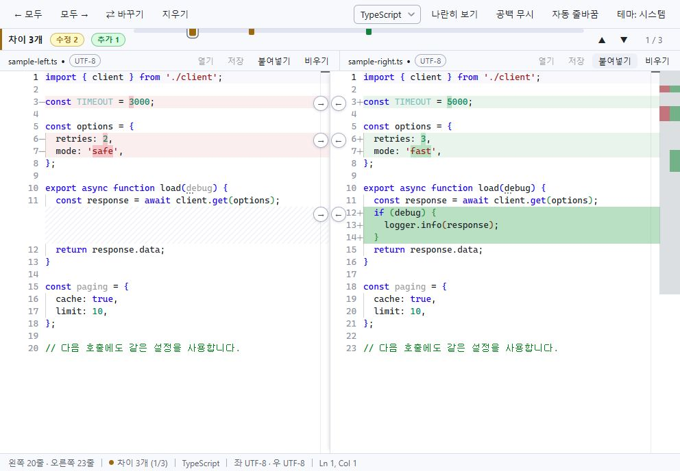
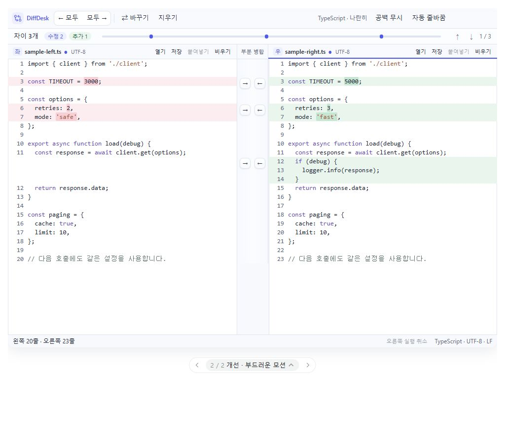

# DiffDesk 전후 화면과 부드러운 모션 시안

작성일: 2026-10-05 · 디자이너 에이전트 제안 반영

추가 요청인 Deep Dark와 에디터 테마 계열 시안은 [테마 확장 계획](2026-10-05-theme-expansion.md)에 정리했다. 기존 부분 병합·모션 계획에 결합하며, 사용자의 작업 진행 지시 후 제품 구현을 시작한다.

## 전후 비교 기준

‘현재 화면’은 현재 체크아웃의 Vite 렌더러를 실행해 캡처했다. 같은 TypeScript 코드, 수정 두 블록과 오른쪽 추가 한 블록, 상단 스크롤 위치, 992×688px 제품 영역으로 비교한다. 운영 중인 설치 파일의 버전까지 확인한 캡처는 아니다. 브라우저 폴백에서 열기·저장이 비활성인 것은 네이티브 파일 API가 없기 때문이며 제품 기능 제거를 뜻하지 않는다.

현재 화면은 실제 캡처, 개선 화면은 버튼을 눌러 볼 수 있는 모형이다. 실제 Monaco·파일 I/O·성능 검증을 마친 제품 구현과 구분한다. 시안의 열기·저장 등 보조 액션은 예제의 로컬 상태만 바꾼다. 부분 적용·양방향 복구가 주된 시연 범위다.

## 디자인 방향

코드 면은 불투명한 단색으로 유지하고, 툴바·파일 헤더·중앙 병합 공간에만 옅은 그라데이션과 작은 그림자를 사용한다. 인디고는 활성 판과 조작에 집중한다. 수정·추가·삭제의 의미는 텍스트와 색을 함께 사용한다.

- 툴바 42px / 결과 밴드 32px / 파일 헤더 30px / 상태줄 26px를 유지한다.
- 688px 높이에서 코드 영역은 현재와 개선 모두 558px다. 상시 작업 행과 기본 사이드바를 추가하지 않는다.
- 코드 글자 크기 13px와 행 간격 18px도 현재 실행 화면에 맞춘다. 카드 여백을 위해 표시 행 수를 줄이지 않는다.
- 부분 병합은 기존 순서 [→][←], 블록별 상시 노출, 한 번 클릭을 유지한다.
- 중앙 공간 64px 안에 클릭 칸 26px, 내부 버튼 면 22px를 배치한다. 내부 면·그림자·포커스 링까지 라인 번호를 침범하지 않아야 한다.
- 파일명 옆에 좌/우 역할을 남기고 활성 판은 얇은 인디고 선으로 표시한다.

## 버튼과 적용 모션

| 동작 | 제안 및 시연 값 |
| --- | --- |
| Hover | 색 전환 140ms, cubic-bezier(.2,.8,.2,1). 대상 블록만 강조 |
| 누름 | 클릭 칸은 고정. 내부 면만 1 → .96, 75ms |
| 놓음 | 내부 면 .96 → 1.008 → 1, 240ms, cubic-bezier(.22,1,.36,1). 빠른 클릭도 짧은 압축을 보여 줌 |
| 적용 | 데이터는 클릭 즉시 변경. 대상 코드 면의 옅은 인디고 강조 360ms, 거터 화살표 → 체크 100ms 교차 전환 |
| 확인 표시 | 기존 슬롯에서 약 800ms 뒤 사라짐. 다른 블록의 조작을 잠그지 않음 |
| 실행 취소 | 대상 판의 내용 즉시 복구. 색과 버튼 면만 부드럽게 안정화 |

이 값은 iOS의 공식 모션 수치를 복제한 것이 아니라, 사용자가 요청한 부드러운 반응을 위한 시안 값이다. 버튼 면의 복원은 매번 현재 시각 상태에서 이어간다. 히트 영역·라인 번호·코드 행 높이·문자·캐럿을 움직이지 않는다. 데이터 적용과 다음 조작을 애니메이션 종료에 묶지 않는다.

모션 축소 환경 또는 시안의 ‘모션 축소’ 설정에서는 transform·강조 애니메이션을 제거하고 정적인 완료 표시를 남긴다. ‘모션 느리게 보기’는 2.5배로 관찰하는 시연 기능이며 제품 기본 속도가 아니다.

## 구현 전 확인할 조건

[부분 병합 중심 계획](2026-10-05-partial-merge-design.md)의 중앙 공간 확보 검증을 먼저 진행한다. 현재 Monaco에 임의 gutterWidth 공개 옵션이 있다고 가정하지 않는다. 실제 엔진에서는 모델 버전과 청크 정체성으로 연타를 검증하고 대상 모델의 undo를 유지한다. 강제 reveal/setPosition을 하지 않으며 비변경 영역의 위치를 보존한다. 변경·삭제 범위 내부의 자연스러운 캐럿 보정은 허용한다.

실제 Electron에서 Windows 100/125/150% 배율, 분할 경계 조절, 긴 줄, 밀집 변경, 최대 파일 크기, CPU 부하를 포함해 확인해야 한다. 모션이 켜졌을 때 입력 지연·프레임 누락이 증가하면 그림자와 피드백 레이어부터 줄인다. 렌더링 프레임률이나 개선된 작업 시간은 아직 측정한 수치로 제시하지 않는다.

## 캡처

제품 소스 변경과 커밋은 하지 않았다.

## 시안 확인

- 1024px 미리보기의 실제 제품 폭 992px에서 높이 688px, 코드 영역 558px, 행 간격 18px를 확인했다. 현재 렌더러의 글자 크기 13px와 행 간격 18px도 직접 측정했다.
- 클릭 전후 병합 버튼의 좌표와 26×26px 클릭 칸이 동일했다. 클릭으로 데이터가 즉시 바뀌고 화살표가 체크로 전환되는 것을 확인했다.
- 오른쪽 한 블록 적용 → 왼쪽 추가 블록 적용 → 왼쪽 취소에서 오른쪽 적용은 유지됐다. 다른 블록은 바뀌지 않았으며 Ctrl+Z로 오른쪽의 직전 적용을 복구했다.
- 960px 미리보기에서도 툴바 42px, 헤더 30px, 코드 영역 558px를 유지했다. 320px 미리보기는 판을 쌓아 표시하며 버튼 넘침과 라인 번호 겹침이 없었다.
- 최종 18px 행 배치에서 라인 번호와 병합 버튼 겹침 0을 확인했다. 시안 실행 중 브라우저 경고·오류는 없었다. 프레임별 모션 시간과 실제 Electron의 프레임률은 아직 계측하지 않았다.
