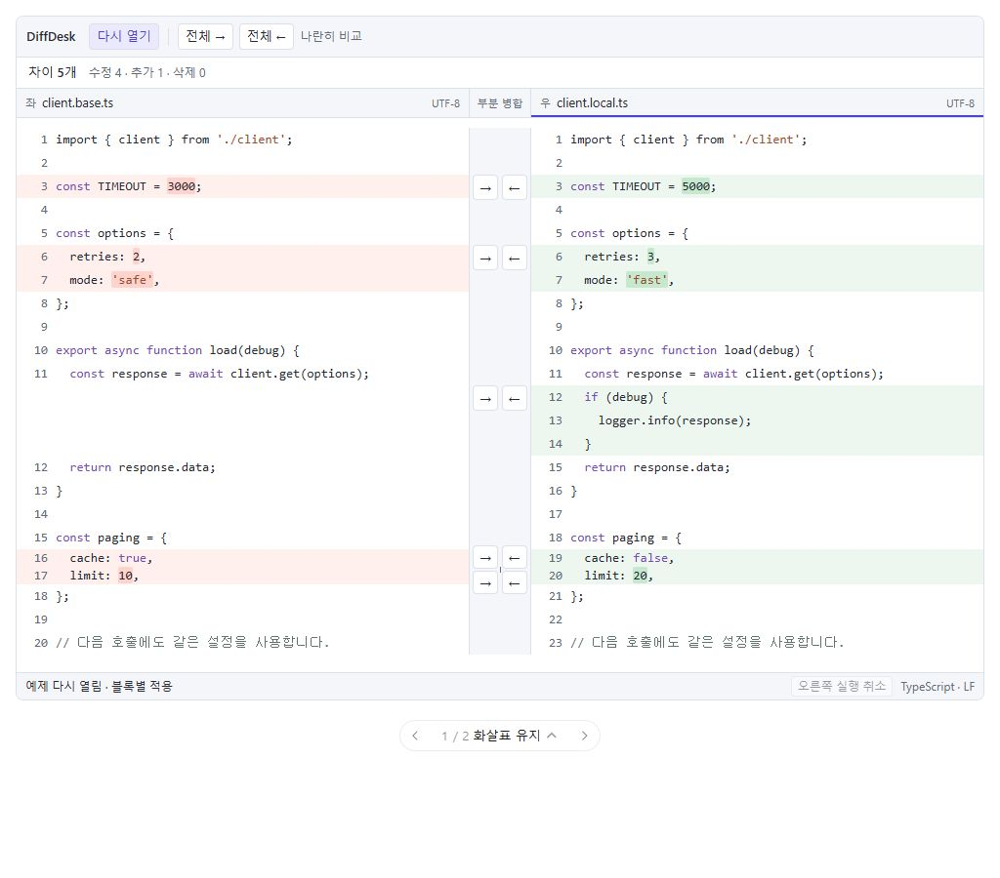
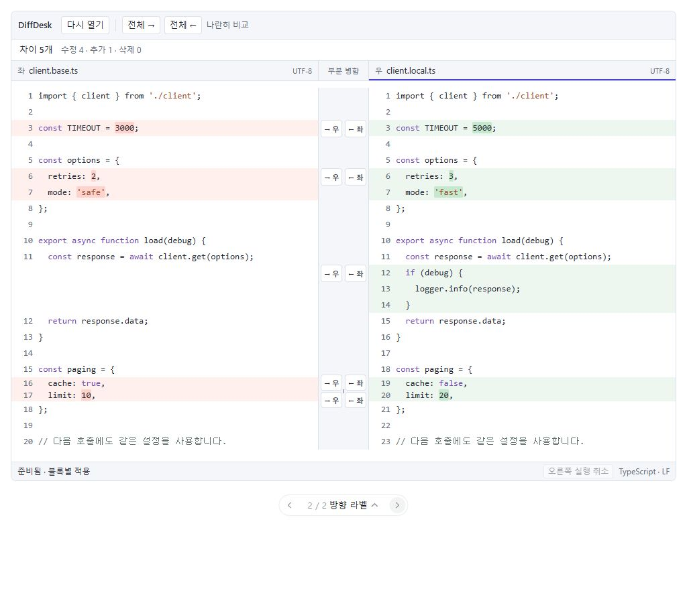

# DiffDesk 부분 병합 중심 디자인 개선안

작성일: 2026-10-05 · 디자이너 에이전트 재검토 반영

추가 시안: [현재 화면 대비 디자인·부드러운 모션](2026-10-05-before-after-motion.md). 아래 부분 병합 조건을 유지하면서 시각 완성도와 버튼 반응을 확장한다.

## 방향 수정

사용자가 자주 쓰는 작업은 **차이를 읽다가 해당 블록 옆에서 필요한 부분만 왼쪽 또는 오른쪽으로 적용하는 것**이다. 이전 시안은 상단의 ‘현재 차이 적용’과 변경 목록을 강조하면서 이 작업에 필요한 이동을 늘렸다. 새안은 블록별 버튼을 화면의 핵심 조작으로 유지한다.

사용자의 추가 조건: **병합 버튼이 라인 번호를 가리면 안 된다.** 이를 버튼 크기보다 먼저 충족해야 하는 배치 조건으로 삼는다.

이 문서는 9월 30일 보고서의 화면 재구성 방향을 대체한다. 당시 확인한 정확한 비교 문구, 잘림 파일 보호, 미저장 문서 보호 등은 그대로 유효하며 별도 보완한다. 제품 소스 변경과 커밋은 하지 않았다.

## 보존할 사용 흐름

- 모든 보이는 차이 블록에 두 방향 버튼을 항상 표시한다. hover, 블록 선택, 상단 이동, 메뉴 열기를 요구하지 않는다.
- 기존 버튼 순서 **[→] [←]**를 유지한다. [→]는 왼쪽 내용을 오른쪽에, [←]는 오른쪽 내용을 왼쪽에 적용한다.
- 부분 적용은 기본적으로 한 번 클릭이다. 일반적인 수정·추가·삭제마다 확인창을 띄우지 않는다.
- 병합 직후 읽던 위치와 비변경 영역의 캐럿·선택을 보존한다. 변경·삭제 범위 안의 캐럿·선택에는 Monaco의 자연스러운 위치 보정을 허용한다. 강제 reveal/setPosition이나 자동 다음 차이 이동을 하지 않는다.
- 사용자가 적용하지 않은 블록은 그대로 남는다. 상단 전체 복사는 별도 명령으로 구분한다.
- 기존 툴바 42px, 결과 밴드 32px, 판 헤더 30px, 상태줄 26px를 기본값으로 유지한다. 상시 ‘현재 차이 적용’ 행과 기본 사이드바는 추가하지 않는다.

## 추천: 전용 중앙 거터의 블록별 버튼

화면을 **왼쪽 코드/라인 번호 | 전용 병합 거터 | 오른쪽 라인 번호/코드**로 나눈다. 헤더와 편집기는 같은 경계를 사용한다.

중앙 거터는 코드 위에 올리는 오버레이가 아니라 레이아웃에서 확보하는 공간이다. 버튼·투명 클릭 영역·포커스 테두리까지 그 안에 들어가야 한다. 양쪽 라인 번호는 각각 편집기 안에 그대로 남는다.

| 선택안 | 중앙 공간 | 조작 | 장점·비용 |
| --- | --- | --- | --- |
| **화살표 유지 — 추천** | 64px 목표 | 블록마다 기존 순서의 →/←, 약 26px 클릭 영역 | 익숙한 빠른 조작 유지. 960px 기준 전체 폭의 약 6.7%를 확보하며 판당 약 32px 비용 |
| 방향 라벨 | 76px 목표 | 블록마다 ‘→ 우 / ← 좌’ | 방향 이해를 돕지만 중앙 영역이 12px 더 넓어짐. 작은 코드 판에서 폭 비용 증가 |

두 안 모두 블록 바로 옆에서 부분 병합하며 라인 번호를 가리지 않는다. 수치는 시안의 목표값이고 Monaco의 실제 레이아웃 구현 검증 뒤 확정한다. 기존 22px 버튼을 단순히 키워 코드 위에 겹치게 배치하지 않는다.

## 블록과 조작의 대응

- 버튼은 블록의 시작 위치에 붙인다. 수정은 대응되는 변경 시작 행, 한쪽에만 있는 블록은 실제 내용이 있는 판의 위치를 기준으로 한다.
- hover나 키보드 focus 시 **그 블록만** 약한 테두리로 강조한다. 반대 방향 버튼까지 같은 강조색으로 채우지 않는다.
- 툴팁/접근성 이름은 실제 효과를 설명한다. 예: ‘왼쪽 9~10행으로 오른쪽 9~10행 교체’, ‘오른쪽에만 있는 3행 삭제’, ‘오른쪽 3행을 왼쪽에 삽입’.
- 삭제 효과도 화살표 조작은 유지한다. 툴팁의 ‘삭제’와 추가/삭제 표시로 의미를 설명한다.
- 버튼은 현재 변경 블록의 범위·종류·모델 버전을 가진 요청에 연결한다. 재계산 후 같은 배열 인덱스가 다른 블록을 뜻하는 상황을 방지한다.

### 짧은 블록이 밀집할 때

24~28px 버튼을 18px 간격으로 겹쳐 쌓지 않는다. 두 쌍이 충돌하면 거터 안에서 각 쌍을 몇 px만 벌리고 짧은 연결선으로 실제 블록 시작 위치를 연결한다. 이때 코드 행, 라인 번호, Monaco 정렬은 움직이지 않는다.

이동 상한을 넘어서는 긴 밀집 구간은 거터 내부에서 작은 밀도로 전환하되 모든 방향 버튼을 계속 표시한다. 투명 클릭 영역을 겹치게 늘리거나 일부 버튼을 숨긴 메뉴로 대체하지 않는다. 작은 타깃의 조작성이 떨어지면 거터 밀도·연결 배치를 재검토한다. 조밀한 시안은 실제 1행 수정/추가/삭제 자료로 별도 검증해야 한다. 현재 모형은 일반적인 세 블록과 충돌 시험용 앵커 두 개를 보여준다.

## 적용·재계산·실행 취소

클릭 즉시 해당 요청을 접수한다. 현재처럼 400ms를 상한으로 둔 상태만으로 새 작업을 허용하는 대신, 최신 모델 버전의 diff 계산 완료를 기준으로 버튼을 갱신한다. 최신 계산이 끝날 때까지 오래된 범위의 버튼은 잠시 비활성화하고 해당 거터에서 처리 상태를 표시한다. 병합 완료 애니메이션 때문에 추가 대기 시간을 넣지 않는다.

적용된 위치에는 짧은 체크 표시를 남긴다. 확인 표시가 끝나기 전에 바로 다음 작업을 할 수 있다. 다음 버튼을 예전 클릭 위치로 자동 이동시켜 연타가 다른 블록에 적용되는 상황도 검증한다.

디자이너 권장 포커스 정책은 **실제로 바뀐 대상 편집기로 포커스만 전환**하는 것이다. setPosition/revealRange로 캐럿이나 스크롤을 이동시키지 않는다. 편집이 발생한 범위 내부의 캐럿·선택에는 엔진의 자연스러운 보정을 허용하며, 비변경 영역과 읽던 위치를 보존한다. 이 정책은 병합 직후 Ctrl+Z가 대상 모델의 병합을 취소하게 하며, 연속 작업에서 강제 화면 이동이 생기지 않는지 실제 Monaco에서 확인한다.

실행 취소는 Monaco의 **판별 undo**를 유지한다. 왼쪽에 적용 후 오른쪽에 적용했다면 오른쪽에서 Ctrl+Z는 오른쪽의 마지막 적용을 되돌린다. 두 판의 모든 작업을 전역 역순으로 취소하는 새 스택은 이번 범위에 넣지 않는다. 시안의 실행 취소도 마지막으로 변경된 대상 판에만 적용한다.

## 디자인과 모션

- 중립적인 작은 버튼을 기본으로 하고 현재 조작 중인 버튼만 인디고로 강조한다.
- 코드의 변경 단어 강조는 유지한다. 블록 전체의 색 면적과 다크 주석 대비를 조절한다.
- 파일 헤더는 한 행을 유지한다. 작은 ‘좌/우’ 표식과 활성 판의 얇은 선으로 대상을 구분한다.
- 버튼 색 전환은 80~100ms, 적용 확인은 약 120ms의 색 변화 정도로 제한한다. 버튼 위치·코드 행 높이·캐럿을 애니메이션하지 않는다.
- 모션 축소 환경에서는 즉시 상태를 바꾸고 정적인 확인 표시를 사용한다. 작업 가능 시점은 실제 계산 완료와 연결한다.

## 기술 전제와 실행 순서

현재 Monaco DiffEditor 공개 옵션에는 임의의 중앙 gutterWidth가 없다. 설치된 버전의 내부 native gutter는 35px이며 기능 유무에 따라 사용된다. 따라서 64/76px 공간이 CSS 몇 줄로 확보된다고 단정할 수 없다. 내부 DOM을 강제로 이동시키거나 두 독립 편집기로 바꾸는 큰 작업을 소규모 개선에 숨겨 넣지 않는다.

1. **배치 가능성 확인 — 약 1일:** 현재 DiffEditor의 지원되는 레이아웃/확장 방식으로 전용 공간을 확보할 수 있는지 검증한다. 960px, 분할 경계 조절, 스크롤, 줄바꿈, 확대에서 버튼·포커스 링과 양쪽 라인 번호의 사각형이 겹치지 않아야 한다. 실패하면 비교 엔진 유지 방식과 필요한 구조 변경의 비용을 별도로 제시한다.
2. **블록 버튼 디자인 — 약 2~3일:** 공간 확보가 가능하다는 전제에서 ChunkStrip/위치 계산/공유 헤더 경계를 적용한다. 항상 노출, 기존 방향 순서, 정확한 효과 설명, 밀집 블록 충돌 처리를 검증한다.
3. **병합 상태·복구 검증 — 약 1~2일:** 재계산 버전 처리, 대상 포커스, 판별 undo, 화면 앵커 유지, 최소한의 완료 피드백을 확인한다.

지원되는 확장 방식이 확인되면 **핵심 개선 약 4~6 작업일**을 추정한다. 구조 변경이 필요하면 이 추정은 다시 산정한다. 9월 전체 감사의 파일 보호 항목까지 포함한 일정은 아니다.

주요 대상: `src/components/ChunkStrip.tsx`, `src/components/DiffHost.tsx`, `src/App.tsx`의 위치 계산·적용·재계산 처리, `src/hooks/useDiffEditor.ts`, `src/styles/components.css`, `src/layout.css`. 판 헤더 경계 정렬에 필요한 부분만 `PaneHeader.tsx`를 수정한다. mergeChunks의 적용 의미와 인코딩·저장 정책은 기존 계약을 유지한다.

## 성공 기준

- 서로 다른 세 블록을 **코드 근처의 세 번 클릭**으로 선택 적용한다. 상단으로 이동하거나 추가 선택 단계를 거치지 않는다.
- 960px/1440px와 Windows 100/125/150%에서 모든 병합 타깃·포커스 링이 라인 번호 및 코드와 겹치지 않는다.
- 1행·연속 짧은 변경·한쪽 추가/삭제·줄바꿈·분할 경계 조절에서도 대상 블록이 명확하다.
- 적용하지 않은 블록은 유지되며, 양방향 적용과 해당 판의 Ctrl+Z가 정확하다.
- 병합 직후 읽던 위치와 비변경 영역의 캐럿·선택이 유지된다. 변경 범위 내부의 자연스러운 위치 보정은 허용하되 강제 이동하지 않는다. 상시 추가 행으로 코드의 세로 공간을 줄이지 않는다.
- 재계산 중 연타·편집·스크롤에 오래된 블록이 적용되지 않는다. 사용자가 클릭을 무시당했는지 알 수 없는 상태를 없앤다.
- 기존 화면과 같은 과제를 수행해 포인터 이동 거리, 클릭 수, 부분 병합 완료 시간, 방향 오선택을 비교한다. 개선된 수치는 아직 측정하지 않았으며 클릭·이동 증가가 발견되면 디자인을 수정한다.

## 시안의 범위

시안은 일반적인 수정 두 블록과 오른쪽 추가 한 블록, 밀집 배치를 보여주는 짧은 수정 두 블록을 각각 적용·취소할 수 있는 설명용 모형이다. 라인 번호와 중앙 버튼은 별도 그리드 영역에 있다. 밀집 두 블록은 18px 간격의 앵커를 가정한 배치 스트레스 자료이며 실제 Monaco가 이 내용을 두 청크로 분리한다는 의미는 아니다.

시안은 적용 후 설명용 행 배열을 유지해 버튼 주변 공간이 갑자기 바뀌지 않도록 한다. 실제 Monaco의 스크롤·계산 중 상태·밀집 충돌·파일 저장을 검증한 구현은 아니며, 위의 첫 단계에서 반드시 확인한다.

## 시안 확인 결과

- 브라우저 외곽 폭 320/960/1024/1440px에서 확인했다. 미리보기의 여백을 뺀 실제 제품 영역은 각각 약 273/928/992/1408px이다. 좁은 미리보기는 두 판을 위아래로 배치한다. 제품의 현재 최소 폭 960px를 모바일 지원으로 바꾸는 제안은 아니다.
- 1024px 시안의 버튼 10개 모두 라인 번호·코드 및 서로의 클릭 영역과 겹치지 않았다. 밀집 두 앵커는 18px, 버튼 시작 위치 간격은 26px로 측정했다. 모든 버튼은 중앙 거터 내부에 놓였으며 양쪽에 최소 3px의 여유가 있다.
- 320px의 두 디자인과 1440px 화살표 디자인에서 라인 번호와 버튼 겹침 0을 확인했다. 960px 방향 라벨 디자인에서도 버튼이 중앙 영역 안에 있음을 확인했다.
- 첫 블록을 오른쪽에 적용한 뒤 추가 블록을 왼쪽에 적용하고, 왼쪽 실행 취소를 누르면 왼쪽 추가만 복구됐다. 먼저 적용한 오른쪽 블록과 다른 차이는 그대로 남았다.
- 오른쪽 추가 블록 삭제/취소, 전체 오른쪽 적용/해당 판 취소를 확인했다. 시안 실행 중 브라우저 경고·오류는 없었다.
- Windows 125/150% 배율, 실제 Monaco의 포커스·커서·스크롤 보존과 비동기 재계산은 아직 확인하지 않았다. 제품 구현의 완료 기준에 남겨 둔다.

