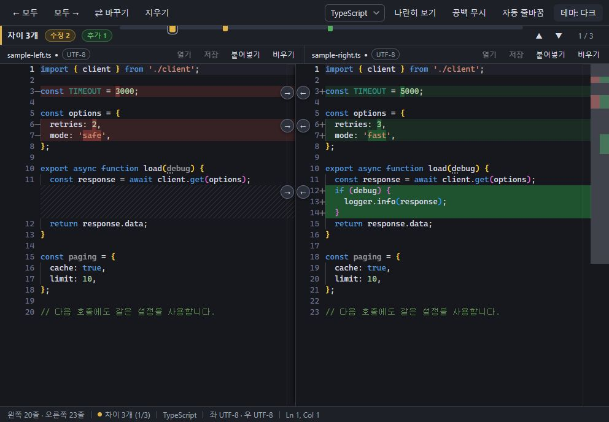
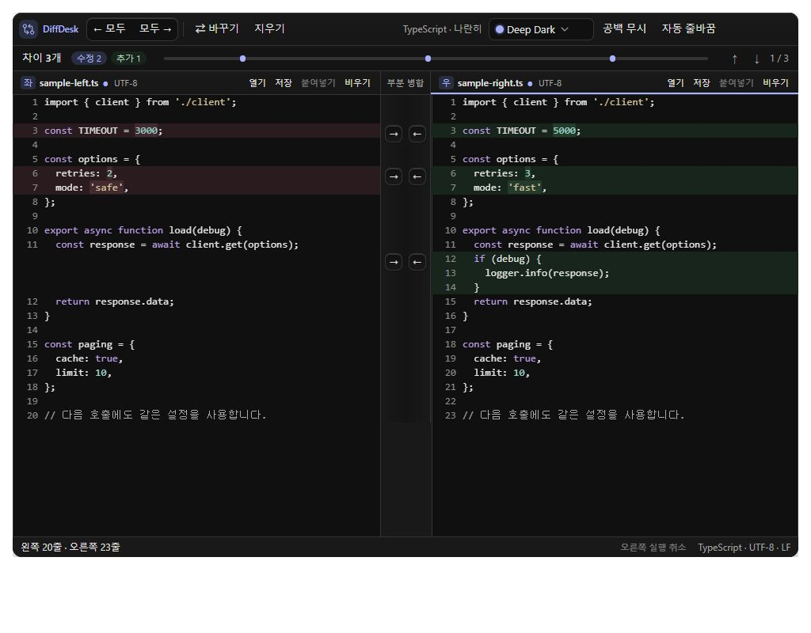
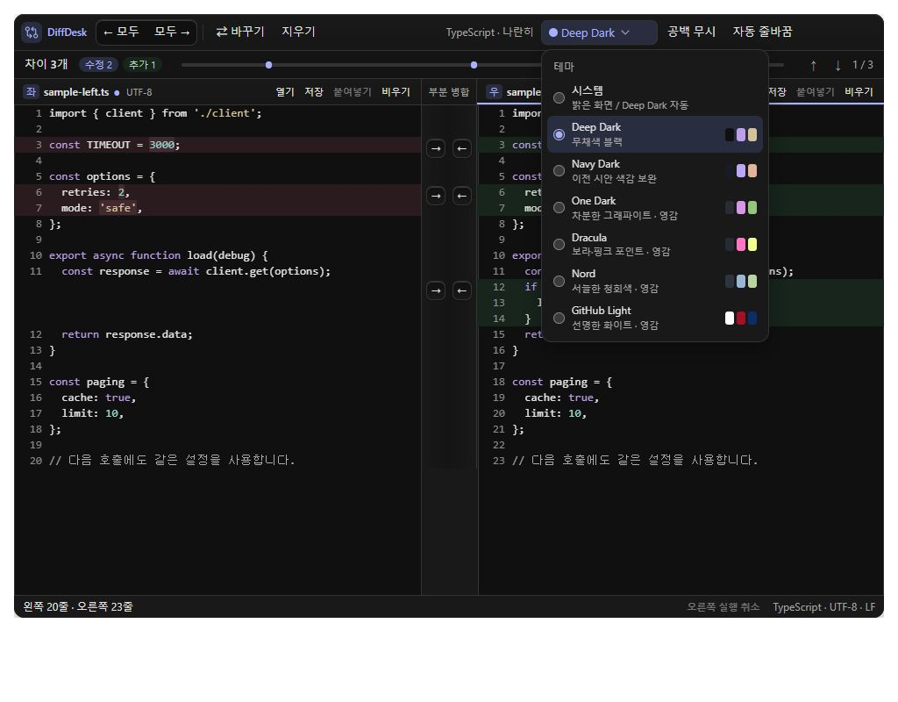
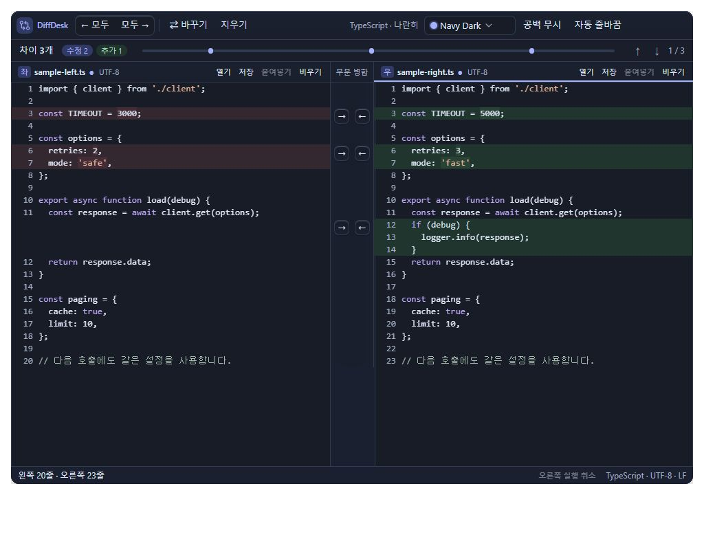
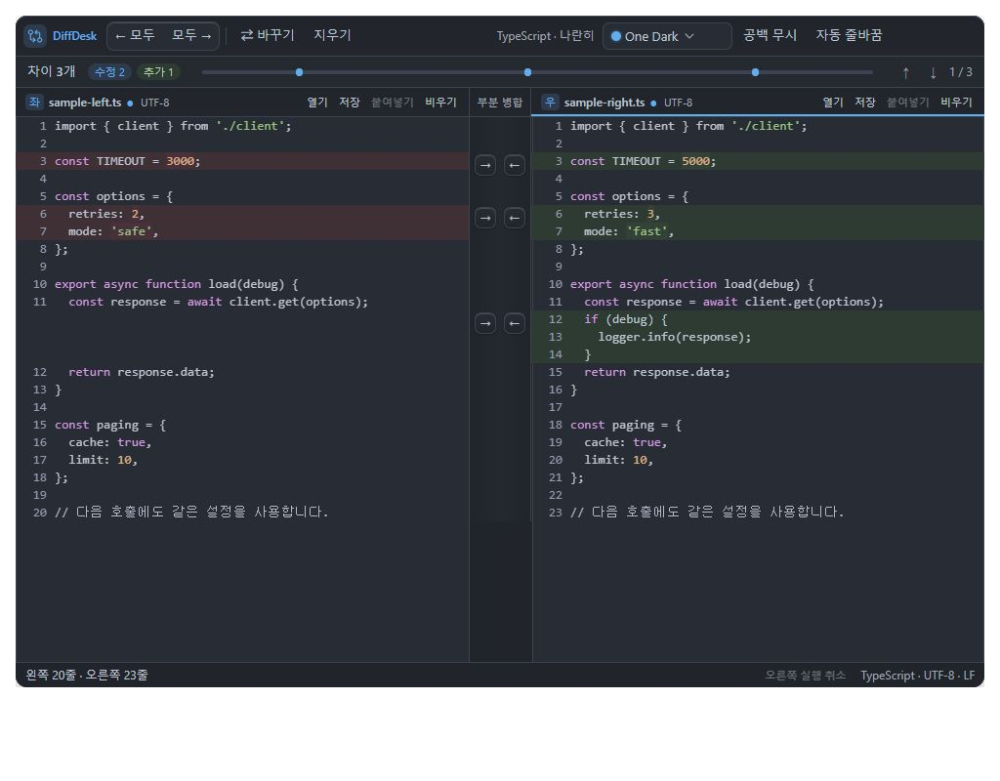
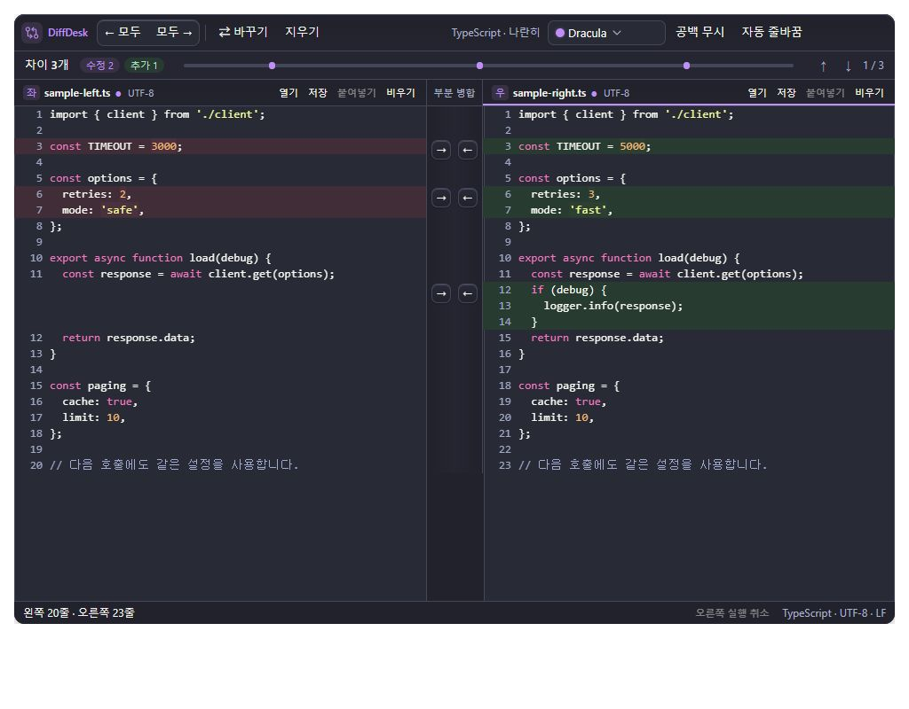
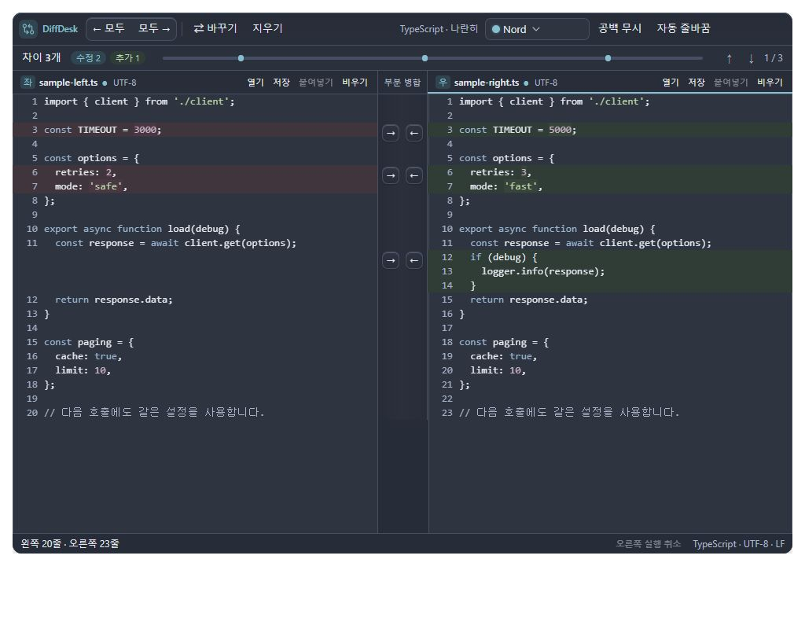
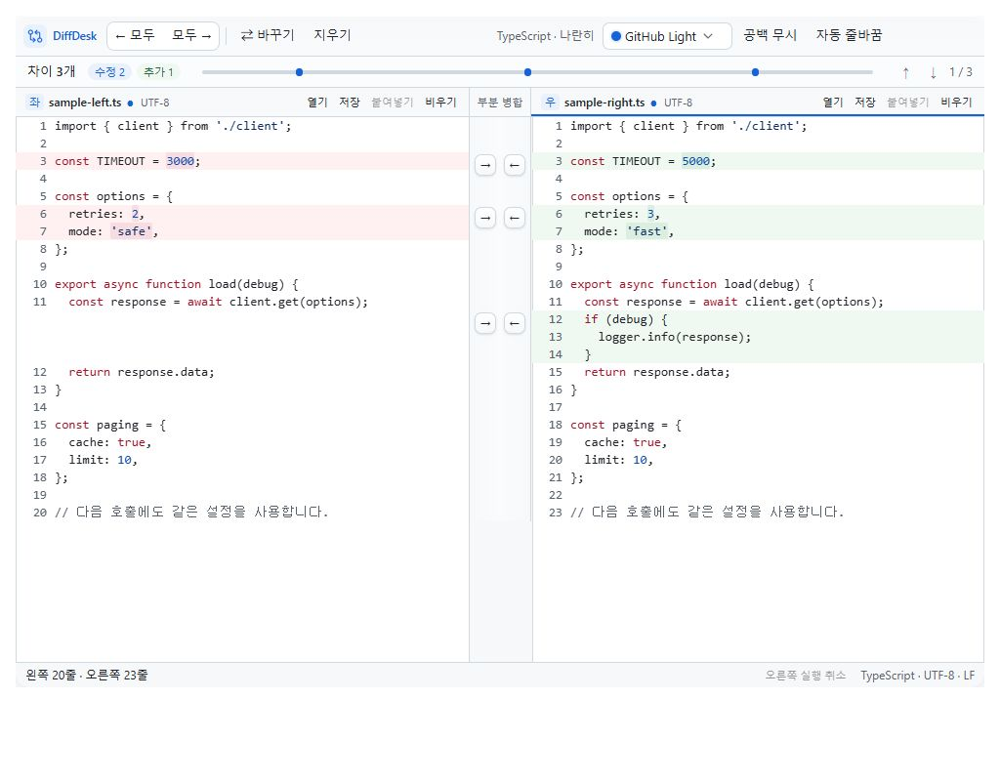

# DiffDesk 테마 확장 시안과 추가 계획

> 보관 문서입니다. 아래 외부 테마 계열 시안은 현재 사용하지 않습니다. 2026-10-07부터 자체 이름·팔레트만 사용하며 최신 결과는 `docs/implementation/2026-10-07-custom-themes.md`를 참조하세요.

작성일: 2026-10-05 · 디자이너 에이전트 팔레트 제안 및 재검토 반영

현재 단계는 시안과 계획이다. 사용자가 **작업 진행**을 지시한 뒤 제품 구현을 시작한다. 제품 소스 변경과 커밋은 하지 않았다.

## 기존 계획에 추가하는 범위

[전후 디자인·모션 계획](2026-10-05-before-after-motion.md)과 [부분 병합 중심 계획](2026-10-05-partial-merge-design.md)에 테마 선택을 추가한다. 블록마다 [→][←] 상시 노출, 한 번 클릭, 번호와 분리된 64px 중앙 공간, 대상 판의 undo를 유지한다. 테마 변경으로 코드 모델을 다시 만들거나 읽던 위치를 이동하지 않는다.

제품의 현행 Dark 소스는 코드 면 `#17181D`, 위젯 면 `#1E2027`이다. 앞서 승인된 모션 시안의 Navy는 `#171C27 / #1B2130`이다. 아래 Navy Dark는 **앞서 본 시안의 색감**을 이어가는 후보이며, 운영 설치본 캡처나 현행 Dark의 정확한 복제라고 표시하지 않는다. 기존 light/dark/system 설정도 구현 시 보존한다.

## 여섯 가지 색감

| 시안 | 방향 | 코드 면 | 툴바·헤더 | 본문 | 조작 포인트 |
| --- | --- | --- | --- | --- | --- |
| Deep Dark | 네이비를 덜어낸 무채색 블랙. 코드가 중심인 어두운 화면 | `#101010` | `#191919` | `#E4E4E4` | `#A7B4FF` |
| Navy Dark | 기존 모션 시안의 청회색. 변경 단어 배경 대비 보완 | `#171C27` | `#1B2130` | `#DFE7F7` | `#A6B5FF` |
| One Dark 영감 | 그래파이트 바탕, 청색 조작·녹색 문자열 | `#282C34` | `#21252B` | `#BDC5D3` | `#61AFEF` |
| Dracula 영감 | 보라 포인트, 핑크 키워드·노란 문자열 | `#282A36` | `#21222C` | `#F8F8F2` | `#BD93F9` |
| Nord 영감 | 청회색 바탕, 저채도 청록·파스텔 구문색 | `#2E3440` | `#272D38` | `#E5E9F0` | `#88C0D0` |
| GitHub Light 영감 | 흰 코드 면, 옅은 회색 크롬과 선명한 청색 조작 | `#FFFFFF` | `#F6F8FA` | `#1F2328` | `#0969DA` |

다크의 추천 첫 후보는 Deep Dark, 조금 더 밝은 다크 대안은 One Dark다. 이는 디자인 제안이며 기존 사용자의 기본 설정을 자동으로 바꾸는 결정은 아니다.

[One Dark Pro](https://github.com/Binaryify/OneDark-Pro), [Dracula](https://github.com/dracula/visual-studio-code), [Nord 공식 팔레트](https://www.nordtheme.com/docs/colors-and-palettes/), [GitHub VS Code 테마](https://github.com/primer/github-vscode-theme)를 색감 참고 대상으로 확인했다. 인기 순위를 산정한 것이 아니다. 원본 테마를 그대로 배포하는 대신, DiffDesk의 변경 배경에서도 읽히도록 주석·일부 구문색과 diff 색을 조정한 시안이다.

| 시안 | 키워드 | 문자열 | 숫자 | 주석 | 선택 배경 |
| --- | --- | --- | --- | --- | --- |
| Deep Dark | `#BCA2EF` | `#D4C295` | `#98D7CB` | `#ABABAB` | `#303A5A` |
| Navy Dark | `#BBAAFA` | `#E5B296` | `#DFE7F7` | `#A5BBAC` | `#303C67` |
| One Dark | `#D49AE8` | `#98C379` | `#E0AE82` | `#B1B9C8` | `#333946` |
| Dracula | `#FF79C6` | `#F1FA8C` | `#FFB86C` | `#A0ABD0` | `#343747` |
| Nord | `#9AB7D5` | `#B8D39F` | `#CBB2C5` | `#AAB6CA` | `#3B4252` |
| GitHub Light | `#A40E26` | `#0A3069` | `#0550AE` | `#57606A` | `#DDEBFF` |

| 시안 | 추가 행 / 단어 | 삭제 행 / 단어 | 지정색 최소 텍스트 대비 |
| --- | --- | --- | --- |
| Deep Dark | `#17251C / #253C2C` | `#291B1E / #432930` | 4.87:1 |
| Navy Dark | `#20352E / #294236` | `#342830 / #432C35` | 5.21:1 |
| One Dark | `#2D3B32 / #334139` | `#3F3036 / #49313B` | 4.90:1 |
| Dracula | `#283B31 / #2D3F33` | `#412D38 / #4B303E` | 4.71:1 |
| Nord | `#303C36 / #36443C` | `#40353D / #493844` | 4.84:1 |
| GitHub Light | `#EFF8F1 / #DCEEE0` | `#FFF1F2 / #F7DDE1` | 4.99:1 |

위 대비는 본문·키워드·문자열·숫자·주석을 코드 면, 추가/삭제 행, 추가/삭제 단어, 선택 배경에서 계산한 최솟값이다. 불투명 지정색 기준이며 실제 렌더 픽셀, 글꼴 안티앨리어싱, 전체 접근성 검증 결과는 아니다. Monaco에 적용할 때도 실제 합성 배경을 다시 확인한다. 시안의 구문 분류는 예제용이므로 실제 언어별 semantic token·진단·검색 표시 검증은 구현 단계에 포함한다.

Deep Dark는 코드·툴바·중앙 공간·그림자를 무채색으로 유지한다. 인디고는 조작에만 쓰며 병합 직후 코드 면은 옅은 중립색으로 강조한다. 수정/추가/삭제의 색 역할은 모든 테마에서 일정하다. 구문색이 빨강인 밝은 테마에서도 삭제 여부를 배경·상태 텍스트로 함께 구분한다.

## 테마 선택과 부드러운 반응

기존 순환 버튼을 현재 이름이 보이는 **28px 높이의 선택 버튼**으로 바꾼다. 42px 툴바 높이는 유지하며 메뉴 안에는 테마 이름·짧은 설명·색 샘플·선택 표시를 둔다. 별도 상시 설정 행이나 사이드바를 추가하지 않는다.

- 클릭으로 메뉴를 열면 현재 선택 항목에 포커스를 둔다. 방향키는 메뉴를 유지한 채 색감을 미리 보여 주고, 클릭/Enter/Space는 닫는다. Escape로 닫고 버튼으로 포커스를 돌린다.
- 메뉴는 약 150ms의 작은 이동과 투명도 전환을 사용한다. 부분 병합의 75ms 누름·240ms 복원은 기존 승인안을 유지한다. 클릭 칸과 코드·번호는 움직이지 않는다.
- 테마는 코드·선택·undo·스크롤·활성 판을 유지하며 팔레트만 바꾼다. 화면 전체 fade, 엔진 재생성, 밝은 배경이 잠깐 보이는 전환을 피한다.
- 모션 축소에서는 transform과 강조 애니메이션을 제거한다. 시안의 느린 모션 옵션은 관찰용이다.
- 시안의 ‘시스템’은 밝을 때 GitHub Light, 어두울 때 Deep Dark를 보여 준다. 이 연결은 미리보기용이며 기존 사용자의 시스템 테마 기본값을 바꿔도 된다는 의미가 아니다.

## 작업 진행 지시 후 구현 순서

1. **설정 계약과 호환성**: 기존 `theme: system/light/dark`를 읽는 동작을 보존하고, 별도 preset 정보를 추가하는 구조를 확정한다. 기존 사용자에게는 현재 Dark/Light도 선택 가능하게 남긴다. 알 수 없는 preset은 기존 설정으로 안전하게 돌아가도록 한다. 공유 IPC 타입·메인 검증·설정 저장·메뉴 명령을 함께 갱신한다.
2. **공통 팔레트와 동기화**: CSS 토큰, Monaco 테마, Electron 최초 창 배경을 같은 정의에서 결정한다. Electron `nativeTheme.themeSource`에는 system/light/dark만 전달하고 preset ID는 전달하지 않는다. 재실행 직후 흰색이나 네이비가 잠깐 나타나지 않게 창 생성 전에 저장 테마를 읽는다.
3. **선택 UI**: 현재 테마 이름·색 샘플·키보드 흐름을 구현한다. 기존 시스템 모드·단축키·메뉴 순환 동작의 의미도 맞춘다. 기존 설정을 자동으로 새 추천 테마에 덮어쓰지 않는다.
4. **기존 디자인·모션 결합**: 중앙 64px 공간 확보 조건을 검증한 뒤 같은 병합 동작을 각 테마에 적용한다. 실제 모델·undo·스크롤을 유지하고 모션 종료와 데이터 적용을 분리한다.
5. **검증**: 여섯 팔레트와 기존 Light/Dark에서 긴 줄·밀집 변경·부분 삽입/삭제·양방향 취소·텍스트 선택·검색·진단을 확인한다. 설정 저장/재실행·OS 테마 변경·100/125/150% 배율·모션 축소도 확인한다. 완료 결과는 사용자에게 보여 주며 커밋은 별도 허락을 받는다.

## 시안에서 확인한 결과와 한계

- 여섯 테마를 전환해 코드 예제와 차이 3개가 유지됐다. 각 테마에서 제품 폭 992px, 툴바 42px/밴드 32px/헤더 30px/상태줄 26px, 코드 영역 558px를 유지했다.
- 오른쪽 한 블록 병합 → 테마 전환 후 코드 내용이 같고 차이 2개·오른쪽 undo가 유지됐다. 취소하면 차이 3개로 복구됐다.
- 960px 미리보기에서도 툴바 42px·코드 558px를 유지했다. 320px 미리보기는 두 판을 쌓고 메뉴를 화면 안에 배치했으며 요소 넘침과 병합 버튼/번호 겹침은 0이었다.
- 선택 항목 포커스, 방향키의 다음 테마 변경과 메뉴 유지, Enter/Escape 닫기, 포인터 선택 닫기를 확인했다. 실행 중 브라우저 경고·오류는 없었다.
- 이 결과는 인터랙티브 모형 검증이다. 실제 Monaco·파일 I/O·Electron 프레임률·배율별 렌더링을 검증한 제품 구현은 아니다. 보조 파일 버튼은 예제 상태만 바꾸며 네이티브 파일 작업을 하지 않는다.

## 화면 기록

현재 소스 실행 Dark와 테마 시안은 구분한다. 현재 캡처는 이전 전후 검토에서 만든 렌더러 화면이며 운영 설치본의 버전까지 확인한 캡처는 아니다.

